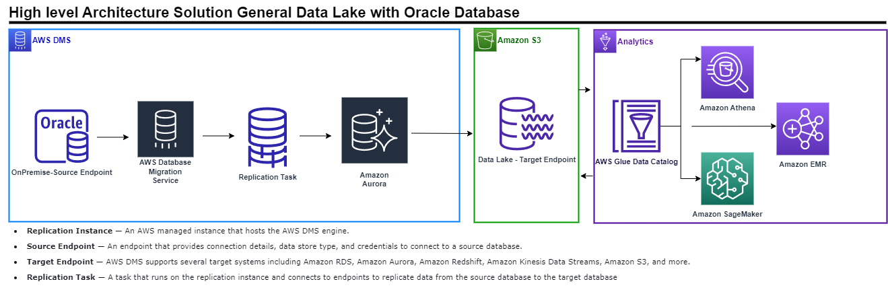
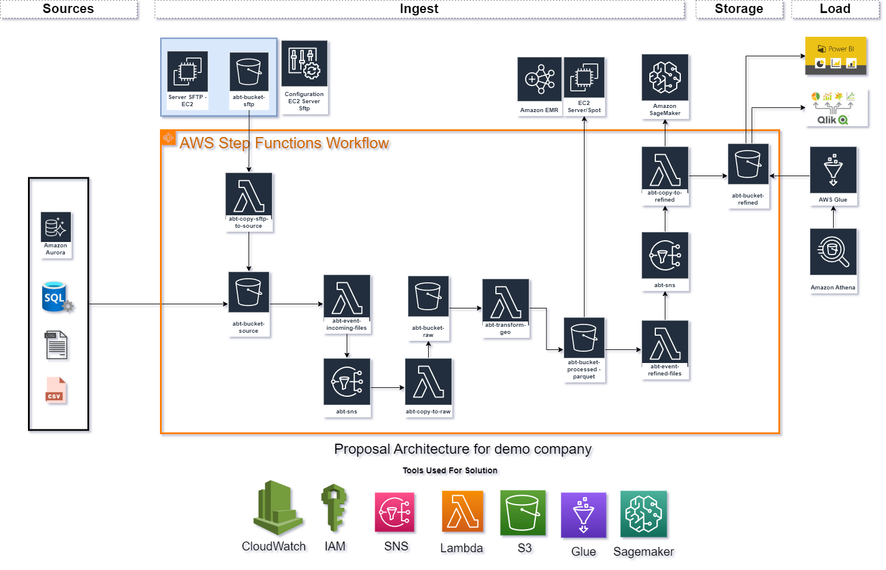
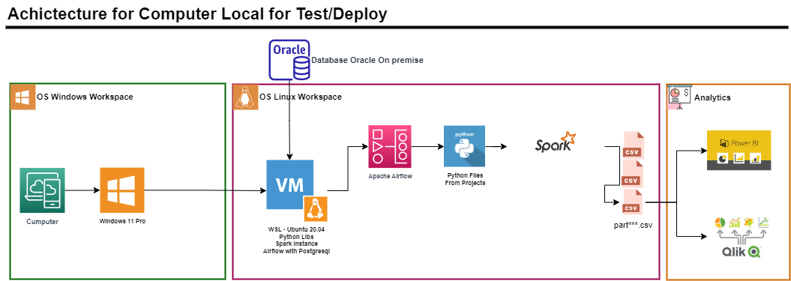
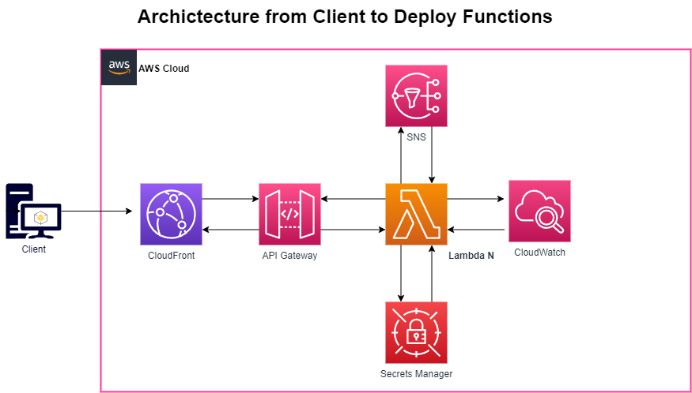
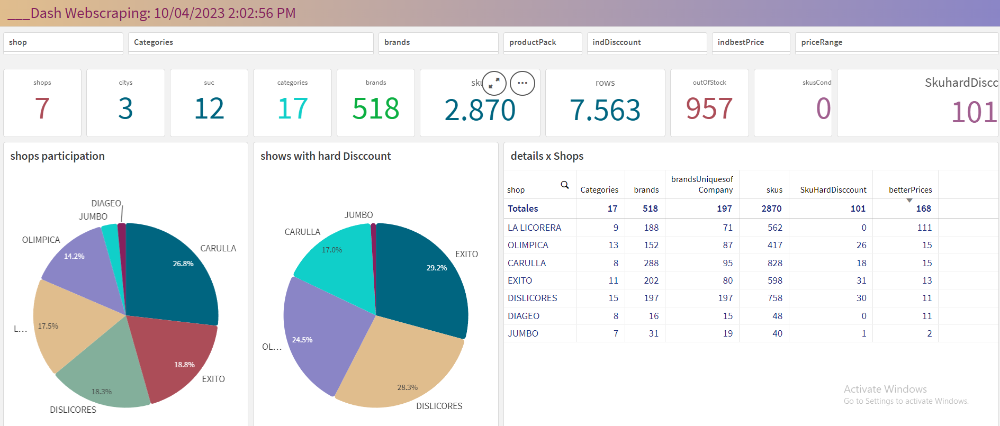

# Data Engineering | Python Developer | Business Intelligence :rocket: | :bar_chart:

## About Me :raising_hand:
### Edwin Sair is a System Engineer that have solid experience of CI/CD in the life cycle of analytics to build applications and innovate,  support teams to drive growth and make contributions across strategy and operations. He is  creative, multifunctional, proficient, dynamic, that provides cutting-edge solutions in the company. He have the capacity for understanding the strategies, visualizing and designing data solutions for different business areas. He enjoy working with tools for data science, learning and researching new technologies

## Key Responsabilities :dart:
- Building, delivering and maintaining data pipelines to support data analytics and Machine Learning work across Credit, Finance, Supply Chain and Commercial.
- Using multiple tools and methods to find trends and correlations by mining data, and couple that with intuition and light-weight tests to prioritize how to drive forward on complicated problems.
- Helping users with strategize, understand, visualize and measure data-driven initiatives causing high impact in visualizations to power leadership decisions.
- Developing impacting analytic solutions using data to influence, problem solving, insights for business and operations teams.
- Working with ELT/ETL tools such Python Libraries, Spark, Airflow, SQL-NoSQL, AWS Tools(Data Lake), Qlik Sense.
- Use Python to Develop Projects for Classification Customer, Clustering, Forecasting, RPA, RFM,  CVLT,  ML, Etc.
- Strong experience in database programming languages such as SQL, PL/SQL.
- Apply best practices and tooling, clean code, testing,documentation, CI/CD, Git, etc.
- Automate critical workflows, tasks recurring related with data and business cases using python
- Creating dashboards and reports in Qlik Sense and Tableau
- Develop in Cloud Computing Ecosystems as AWS and machine locals.

## Skills :bulb:
- Working with Teams.
- Strong communication skills.
- Effective stakeholder engagement.
- Critical Thinking.
- Problem solving.
- Decision Making
- Programming, Data Management, Data Modeling, Data Wrangling, Data Visualization, Statistics Analysis, Big Data, Machine Learning.

## Professional Capabilities :bookmark_tabs:
- Solid planning, priority setting, and project management skills with experience managing multiple projects concurrently.
- Identify relevant data sources for business needs.
- Organizing data into usable formats.
- Generating information and insights from data sets and identifying trends and patterns.
- Modeling business processes and identifying opportunities for process improvements​.
- Outstanding analytical and problem-solving abilities.

## Projects :scroll:
*In this space you will find the most important projects that edwin sair has developed.*

1. Workflows and Cloud Architectures
2. Data Science|Python Projects|Analytics
3. Personal Projects


## 1. Workflows and Cloud Architectures :cloud:

#### A data lake is an increasingly popular way to store and analyze data because it allows businesses to store all of their data, structured and unstructured, in a centralized repository. The next image show the high level solution, that i am using.



#### Data Lake allow structured and unstructured data in one centralized repository and at any scale. You can store data as is without having to first structure it based on questions you might have in the future. Data lakes also allow you to run different types of analytics on your data, like SQL queries, big data analytics, full-text search, real-time analytics, and machine learning (ML) to guide better decisions. This next image show an example more detailed for processing data with different sources.



#### WSL, for Windows Subsystem for Linux, as the name suggests, increases workflow efficiency and reduces the time to develop locally. I use daily this tool because i have some projects that requieres run on windows, ML, RPA, WebScrappig, etc.



#### AWS Lambda is a serverless computing service provided by Amazon Web Services (AWS). Users of AWS Lambda create functions, self-contained applications written in one of the supported languages and runtimes, and upload them to AWS Lambda, which executes those functions in an efficient and flexible manner.



## 2. Data Science|Python Projects|Analytics 	:bookmark_tabs: :chart_with_upwards_trend:

*Before of deep dive know the concepts and tools of data science is very import.*

#### Data science is the study of data to extract meaningful insights for business. It is a multidisciplinary approach that combines principles and practices from the fields of mathematics, statistics, artificial intelligence, and computer engineering to analyze large amounts of data. This analysis helps data scientist/engineer to ask and answer questions like what happened, why it happened, what will happen, and what can be done with the results also: 

- Data science tools help businesses to speed up data science workflows by integrating data from various sources and implementing multiple algorithms and techniques on the data.
- Data science tools use computer science, statistics, predictive analytics, etc. to dig deeper into complex data by acquiring, manipulating, and analyzing business data to derive valuable insights.
- Businesses can also leverage data science tools for faster decision-making as these tools enable them to monitor data in real time and offer them additional flexibility.

Common tools used in my daily activities: :sparkles:
- Jupyter Notebook.
- Pandas, Numpy, Pandas Profiling.
- Apache Spark(PySpark), Hadoop.
- Matplotlib, Seaborn, Ploty.
- Scrappy, Request, Beautifulsoup, Selenium.
- Sklearn, Statsmodels.
- OpenCV, Pytesseract, KerasOCR, Yolo v5.
- TensorFlow, PyTorch.
- Spacy, NLTK.
- RPA Framework.
- SQLAlchemy, MySQL Connector.
- Airflow, Step Functions.
- SQL Server, PL SQL, MongoDB.
- Qlik Sense, Tableau, PowerBI.
- Github

### Scrapping Projects :earth_americas:
#### Web scraping is a way of collecting data from a website by means of a script that reads the content from the pages on the website and then stores the data in a database or spreadsheet. This is a example of some supermarkets in colombia with his brands, skus and categories and share.



#### :round_pushpin: Piece of Code For Extraction :round_pushpin:
``` python

from selenium.webdriver.support.ui import WebDriverWait
from selenium.webdriver.support.ui import Select
from selenium.webdriver.common.action_chains import ActionChains
from webdriver_manager.chrome import ChromeDriverManager
from selenium.webdriver.chrome.service import Service as ChromeService
from selenium.webdriver.support import expected_conditions as EC

initial_XPATH = "//div[contains(@class,'vtex-button__label flex items-center justify-center h-100 ph5')]"
# define the max clicks for page for default 30
max_click_SHOW_MORE = 35
# count the number of clicks
count = 1
# This loop search the button load more and apply the click until the end of page
while count <= max_click_SHOW_MORE:
    try:
        WebDriverWait(driver, 30).until(
            EC.visibility_of_element_located((By.XPATH, initial_XPATH)))
        time.sleep(5)    
        WebDriverWait(driver, 20).until(
            EC.element_to_be_clickable((By.XPATH, initial_XPATH))).click()
        count += 1
        time.sleep(2)
        # Bar progress -> comment
        for i in track(range(4), description=f"[red]Exploring  Web iter {count - 1}.........."):
            time.sleep(1)

    except TimeoutException:
        break
```

