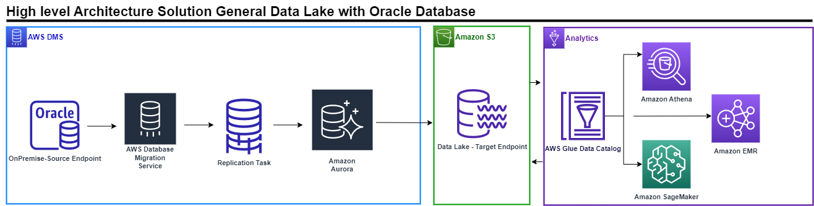
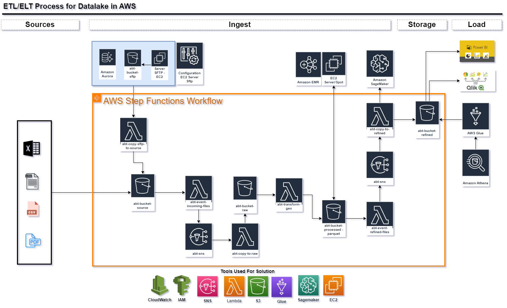

# Data Engineering | Python Developer | Business Intelligence :rocket: | :bar_chart:

## About Me :raising_hand:
### Edwin Sair is a System Engineer that have solid experience of CI/CD in the life cycle of analytics to build applications and innovate,  support teams to drive growth and make contributions across strategy and operations. He is  creative, multifunctional, proficient, dynamic, that provides cutting-edge solutions in the company. He have the capacity for understanding the strategies, visualizing and designing data solutions for different business areas. He enjoy working with tools for data science, learning and researching new technologies

## Key Responsabilities :dart:
- Building, delivering and maintaining data pipelines to support data analytics and Machine Learning work across Credit, Finance, Supply Chain and Commercial.
- Using multiple tools and methods to find trends and correlations by mining data, and couple that with intuition and light-weight tests to prioritize how to drive forward on complicated problems.
- Helping users with strategize, understand, visualize and measure data-driven initiatives causing high impact in visualizations to power leadership decisions.
- Developing impacting analytic solutions using data to influence, problem solving, insights for business and operations teams.
- Working with ELT/ETL tools such Python Libraries, Spark, Airflow, SQL-NoSQL, AWS Tools(Data Lake), Qlik Sense.
- Use Python to Develop Projects for Classification Customer, Clustering, Forecasting, RPA, RFM,  CVLT,  ML, Etc.
- Strong experience in database programming languages such as SQL, PL/SQL.
- Apply best practices and tooling, clean code, testing,documentation, CI/CD, Git, etc.
- Automate critical workflows, tasks repetitives related with data and bussines cases using python
- Creating dashboards and reports in Qlik Sense and Tableau
Develop in Cloud Computing Ecosystems as AWS and machine locals.

## Skills :bulb:
- Working with Teams.
- Strong communication skills.
- Effective stakeholder engagement.
- Critical Thinking.
- Problem solving.
- Decision Making
- Programming, Data Management, Data Modeling, Data Wrangling, Data Visualization, Statistics Analysis, Big Data, Machine Learning.

## Professional Capabilities :bookmark_tabs:
- Solid planning, priority setting, and project management skills with experience managing multiple projects concurrently.
- Identify relevant data sources for business needs.
- Organizing data into usable formats.
- Generating information and insights from data sets and identifying trends and patterns.
- Modeling business processes and identifying opportunities for process improvements​.

## Projects
*In this space you will find the most important projects that edwin sair has developed.*

1. Workflows and Cloud Architectures
2. Data Visualization
3. Code 
4. Personal Projects

## 1. Workflows and Cloud Architectures

### A data lake is an increasingly popular way to store and analyze data because it allows businesses to store all of their data, structured and unstructured, in a centralized repository. The next image show the high level solution, that i am using

### Data Visualization